# 项目介绍

​	项目分为管理端和用户端。
​	用户端允许用户进行项目的登录，在用户登录成功之后，用户可以拥有权限去添加自定义任务，定义任务的内容，发送时间，接收人等。同时，项目提供了类似于日记一样的功能，用户可以上传照片，同时绑定双方的账号并绑定情侣关系，然后就可以记录在某一天发生了什么故事。由于消息通过的是电子邮件发送，因此要求用户开启对应的电子邮件发送的权限以及接收方也要开启电子邮件，否则将无法方便的看到收发的电子邮件。
​	比如我的微信绑定了我的QQ邮箱，因此我能在微信查看QQ邮箱收到的邮件。同时我也可以使用自己的QQ邮箱查看我的短信是否发送成功。
情况如下：

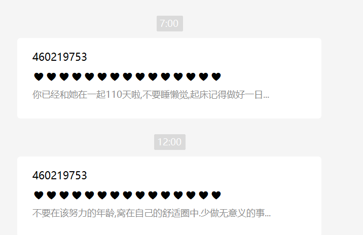


​	对于管理端，管理端可以管理所有的用户自定义的消息，删除一些消息，同时如果某个用户的消息被删除了，那么对应的用户也需要接收到对应的提醒。因此用户端会在其邮箱中接收到对应的消息，邮箱的实现通过数据库实现。
​	请求的流程处理过程也按照这里的模块排序进行。
​	如下是项目中各个服务的端口。

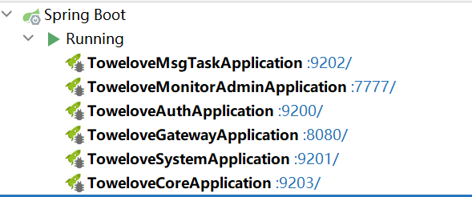

## Nginx负载均衡与请求重定向模块

​	这个模块用于将前端的请求进行接收，并进行请求重定向或者负载均衡。
​	对于一些单纯只是访问静态页面的请求，我们直接使用Nginx中的缓存为其提供服务。
​	若其访问的是需要后端代码进行配合的项目，那么我们会将请求发送到Gateway网关中进行处理。
​	Nginx的端口默认监听80，我们的网关服务端口为8080。

## Gateway网关模块

​	网关使用的是spring-gateway，其本质是一个过滤器链。
​	在当前模块，我们提供了验证码加载，限流，熔断，负载均衡，请求重定向，非法请求过滤，请求头信息存放等功能。
​	网关模块提供限流和熔断功能，当某一次的请求处理失败后，开启熔断和限流功能，来防止系统的崩溃。
​	这里我们为网关模块整合了sentinel，这确保了我们可以使用sentinel轻松的控制项目的流量，来防止项目的奔溃。
​	同时，我们的登录注册请求需要使用到验证码，因此我们在网关模块直接提供了验证码模块，当当前请求需要使用到验证码时，就会为其提供验证码支持，并且我们首先会对验证码进行校验，如果验证码错误，那么直接进行拦截返回，直到用户输入正确的验证码。
​	同时项目提供黑名单功能，将会拦截部分的黑名单用户，来减少系统受到的威胁。

### 验证码 

​	验证码模块使用的是kaptcha。

​	 kaptcha是基于配置的方式来实现生成验证码的，通过该插件根据生成规则可以自动的将验证码字符串转变成图片流返回给请求发送端，同时可以通过配置文件方式，将生成验证码字符串与session关联。

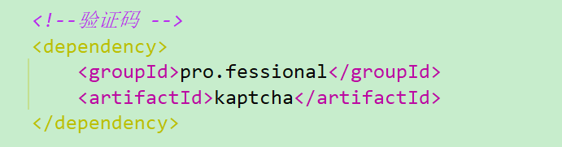

[kaptcha基本使用]: https://blog.51cto.com/u_14627411/3044720

​	网络上的kaptcha的配置可能比较老旧，都是jsp的，我当初也是用jsp配置kaptcha，不过还挺麻烦，有了SpringBoot配置会快很多，如下。

```
@Configuration
    public DefaultKaptcha getKaptchaBean()
    {
        DefaultKaptcha defaultKaptcha = new DefaultKaptcha();
        Properties properties = new Properties();
        // 是否有边框 默认为true 我们可以自己设置yes，no
        properties.setProperty(KAPTCHA_BORDER, "yes");
        // 验证码文本字符颜色 默认为Color.BLACK
        properties.setProperty(KAPTCHA_TEXTPRODUCER_FONT_COLOR, "black");
        // 验证码图片宽度 默认为200
        properties.setProperty(KAPTCHA_IMAGE_WIDTH, "160");
        // 验证码图片高度 默认为50
        properties.setProperty(KAPTCHA_IMAGE_HEIGHT, "60");
        // 验证码文本字符大小 默认为40
        properties.setProperty(KAPTCHA_TEXTPRODUCER_FONT_SIZE, "38");
        // KAPTCHA_SESSION_KEY
        properties.setProperty(KAPTCHA_SESSION_CONFIG_KEY, "kaptchaCode");
        // 验证码文本字符长度 默认为5
        properties.setProperty(KAPTCHA_TEXTPRODUCER_CHAR_LENGTH, "4");
        // 验证码文本字体样式 默认为new Font("Arial", 1, fontSize), new Font("Courier", 1, fontSize)
        properties.setProperty(KAPTCHA_TEXTPRODUCER_FONT_NAMES, "Arial,Courier");
        // 图片样式 水纹com.google.code.kaptcha.impl.WaterRipple 鱼眼com.google.code.kaptcha.impl.FishEyeGimpy
        // 阴影com.google.code.kaptcha.impl.ShadowGimpy
        properties.setProperty(KAPTCHA_OBSCURIFICATOR_IMPL, "com.google.code.kaptcha.impl.ShadowGimpy");
        Config config = new Config(properties);
        defaultKaptcha.setConfig(config);
        return defaultKaptcha;
    }

    @Bean(name = "captchaProducerMath")
    public DefaultKaptcha getKaptchaBeanMath()
    {
        DefaultKaptcha defaultKaptcha = new DefaultKaptcha();
        Properties properties = new Properties();
        // 是否有边框 默认为true 我们可以自己设置yes，no
        properties.setProperty(KAPTCHA_BORDER, "yes");
        // 边框颜色 默认为Color.BLACK
        properties.setProperty(KAPTCHA_BORDER_COLOR, "105,179,90");
        // 验证码文本字符颜色 默认为Color.BLACK
        properties.setProperty(KAPTCHA_TEXTPRODUCER_FONT_COLOR, "blue");
        // 验证码图片宽度 默认为200
        properties.setProperty(KAPTCHA_IMAGE_WIDTH, "160");
        // 验证码图片高度 默认为50
        properties.setProperty(KAPTCHA_IMAGE_HEIGHT, "60");
        // 验证码文本字符大小 默认为40
        properties.setProperty(KAPTCHA_TEXTPRODUCER_FONT_SIZE, "35");
        // KAPTCHA_SESSION_KEY
        properties.setProperty(KAPTCHA_SESSION_CONFIG_KEY, "kaptchaCodeMath");
        // 验证码文本生成器
        properties.setProperty(KAPTCHA_TEXTPRODUCER_IMPL, "com.towelove.gateway.config.KaptchaTextCreator");
        // 验证码文本字符间距 默认为2
        properties.setProperty(KAPTCHA_TEXTPRODUCER_CHAR_SPACE, "3");
        // 验证码文本字符长度 默认为5
        properties.setProperty(KAPTCHA_TEXTPRODUCER_CHAR_LENGTH, "6");
        // 验证码文本字体样式 默认为new Font("Arial", 1, fontSize), new Font("Courier", 1, fontSize)
        properties.setProperty(KAPTCHA_TEXTPRODUCER_FONT_NAMES, "Arial,Courier");
        // 验证码噪点颜色 默认为Color.BLACK
        properties.setProperty(KAPTCHA_NOISE_COLOR, "white");
        // 干扰实现类
        properties.setProperty(KAPTCHA_NOISE_IMPL, "com.google.code.kaptcha.impl.NoNoise");
            // 图片样式 水纹com.google.code.kaptcha.impl.WaterRipple
            // 鱼眼com.google.code.kaptcha.impl.FishEyeGimpy 阴影com.google.code.kaptcha.impl.ShadowGimpy
            properties.setProperty(KAPTCHA_OBSCURIFICATOR_IMPL, "com.google.code.kaptcha.impl.ShadowGimpy");
            Config config = new Config(properties);
            defaultKaptcha.setConfig(config);
            return defaultKaptcha;
            }
            }
```

​	上面已经完成了对kaptcha的配置了，我们可以使用默认的kaptcha为我们提供的验证码格式生成器，当然，我们也可以按照人家的要求，自己实现一个。


```java
package com.towelove.gateway.config;

public class KaptchaTextCreator extends DefaultTextCreator
{
    private static final String[] CNUMBERS = "0,1,2,3,4,5,6,7,8,9,10".split(",");

    @Override
    public String getText()
    {
        Integer result = 0;
        Random random = new Random();
        int x = random.nextInt(10);
        int y = random.nextInt(10);
        StringBuilder suChinese = new StringBuilder();
        int randomoperands = random.nextInt(3);
        if (randomoperands == 0)
        {
            result = x * y;
            suChinese.append(CNUMBERS[x]);
            suChinese.append("*");
            suChinese.append(CNUMBERS[y]);
        }
        else if (randomoperands == 1)
        {
            if ((x != 0) && y % x == 0)
            {
                result = y / x;
                suChinese.append(CNUMBERS[y]);
                suChinese.append("/");
                suChinese.append(CNUMBERS[x]);
            }
            else
            {
                result = x + y;
                suChinese.append(CNUMBERS[x]);
                suChinese.append("+");
                suChinese.append(CNUMBERS[y]);
            }
        }
        else if (randomoperands == 2)
        {
            if (x >= y)
            {
                result = x - y;
                suChinese.append(CNUMBERS[x]);
                suChinese.append("-");
                suChinese.append(CNUMBERS[y]);
            }
            else
            {
                result = y - x;
                suChinese.append(CNUMBERS[y]);
                suChinese.append("-");
                suChinese.append(CNUMBERS[x]);
            }
        }
        else
        {
            result = x + y;
            suChinese.append(CNUMBERS[x]);
            suChinese.append("+");
            suChinese.append(CNUMBERS[y]);
        }
        suChinese.append("=?@" + result);
        return suChinese.toString();
    }
}
```

​	如果选择使用自己设定的验证码格式生成器，需要按照如下对配置文件进行配置

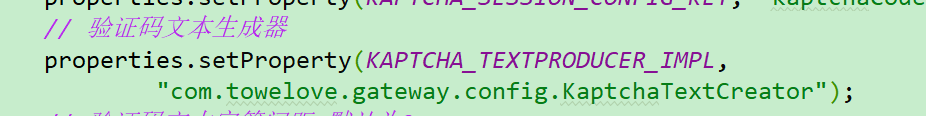

​	然后我们就可以为前端的获取验证码的请求进行路径设置了，这里就不创建controller层在gateway这个项目中了，直接使用SpringBoot提供的RouterFunction。

​	如果不同什么是RouterFunction，可以参考WebMvc的函数式编程

​	按照这种方式，我们就可以把验证码的返回流程简化如下

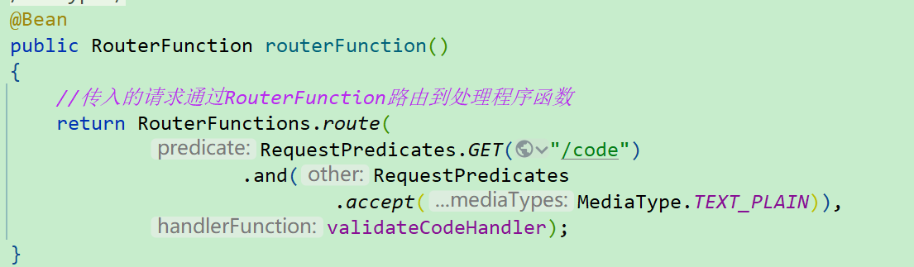

	然后我们使用apifox发送一个请求来获取验证码

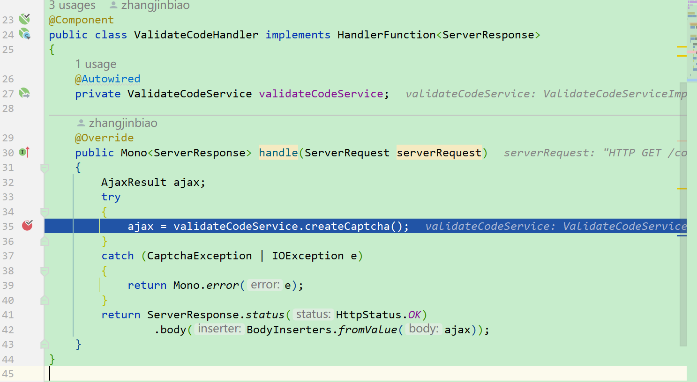

​	返回如下

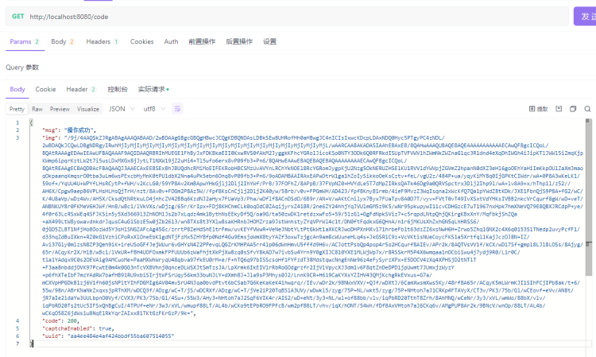

	然后打开redis查看验证码答案，这里的uuid其实就是验证码的唯一标签。

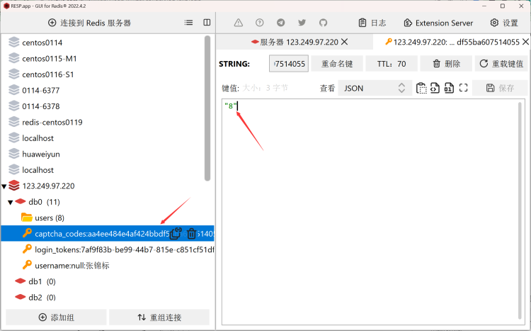

	之后，只需要对登录以及注册流程提供验证码服务即可，其他服务路径直接排除。

​	按照上面的处理流程，当前的请求是一个登录请求，那么是需要验证码校验的，因此前面高优先级的过滤器直接放行，直接进入到验证码校验的过滤器进行验证码的校验。

​	下图是过滤器的过滤顺序。



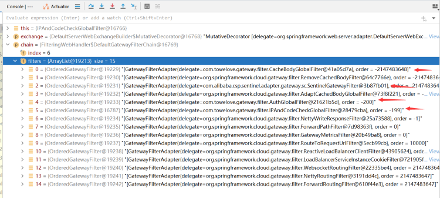


​	如果验证码错误，那么返回验证码错误。

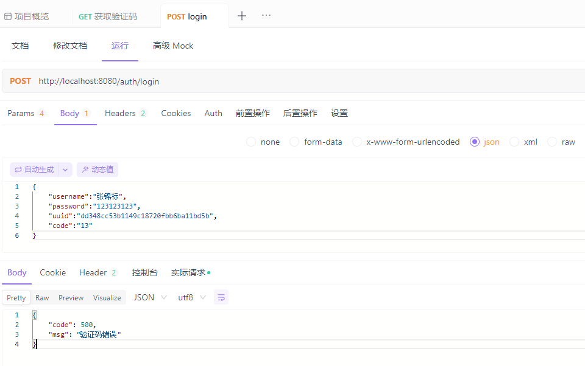

​	反之，验证码正确，则返回token。



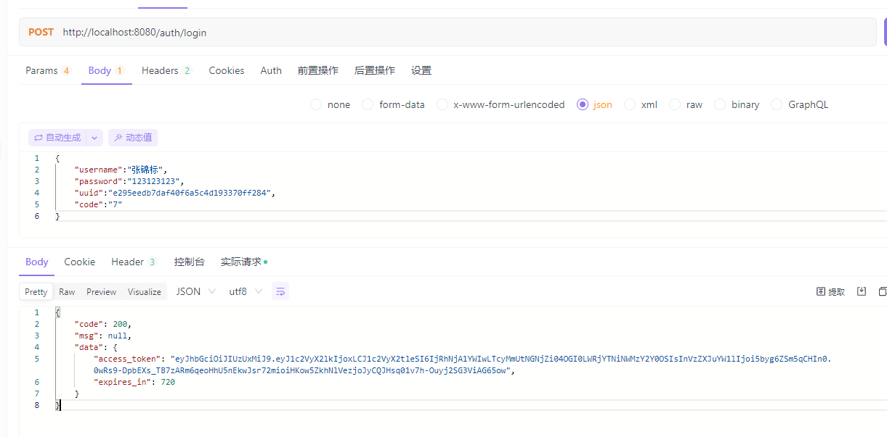



​	同时，如果一个用户在指定时间内请求过多次数的接口，将会被加入黑名单。



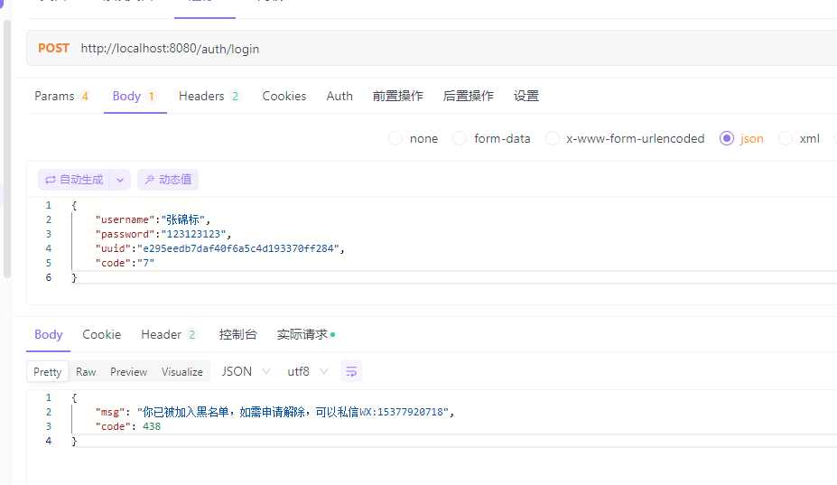


### 请求头设定 

​	为了方便之后的鉴权功能，我们将登录的用户的数据，放在请求头中，方便SpringSecurity模块到时候从请求头中获取对应的用户信息来进行权限校验。



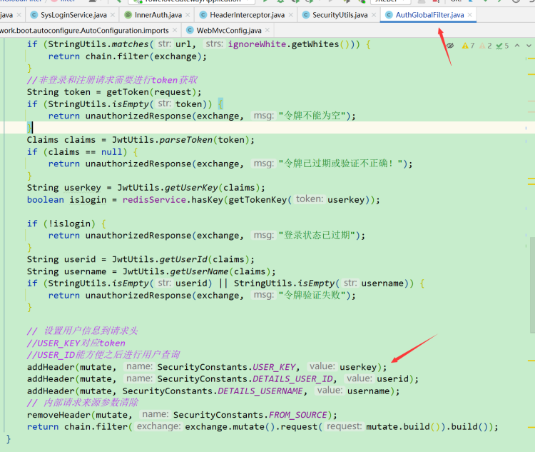

	到此位置，网关部分基本结束。


## SpringSecurity鉴权模块

​	可以这样子理解这个模块，我们知道如果是一个正常的项目，我们可以直接使用RESTFUL风格来设定请求的路径和参数，但是对于普通用户，他们肯定是不允许去查询其他用户的信息的，这种操作只允许管理员进行。

​	那么如果我们使用正常的开发方式，比如我们设定用户查寻自己信息的请求路径为/sys/user/query/{userId}，那么如果对于某些带有恶意的人员，他们可能就可以猜测出可能的查询所有用户信息的路径，比如/admin/user/query/{userId}（查询某个用户）或者/admin/user/query（查询所有用户）。

​	因此，用户的信息就会直接泄露，那么如何解决这种问题？

​	首先就是要求当前浏览器发起请求的时候，要求带有我们系统发送给他的token，但是这个token其实只需要一个登录用户都是拥有的，那么为了防止上面的问题，我们就需要在进行一次校验，我们解析出token携带的信息之后，将这个信息放入到数据库去查询，查询当前用户对应的权限，如果权限不允许其进行这种查询操作，那么我们就进行报错返回。因此，使用这种方式，我们就需要多维护一些数据库的表，比如权限表，用户角色表，但是这样子就能解决上面可能出现的问题了，大大提高了系统的安全性。

​	SpringSecurity提供了许多原生的注解，比如@PreAuthorization等注解。这些注解可以很方便的帮助我们完成当前用户角色的校验。

​	这里直接使用SpringSecurity的过滤器链来进行数据的过滤比较麻烦，因为依旧是需要访问数据库。

​	所以我们将请求都使用Feign的方式来远程请求了，并且当需要对用户权限进行校验的时候，我们直接从上面的请求头中把数据保存到每一个线程对应的SecurityContextHolder中，如下：



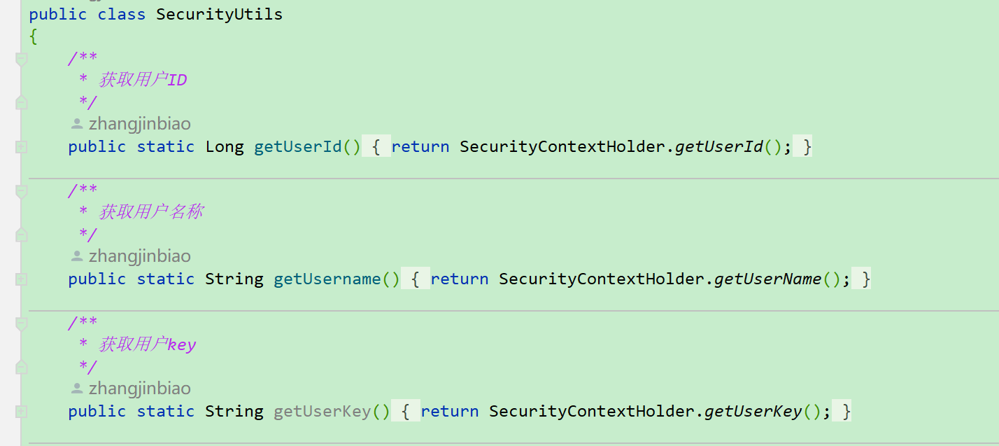





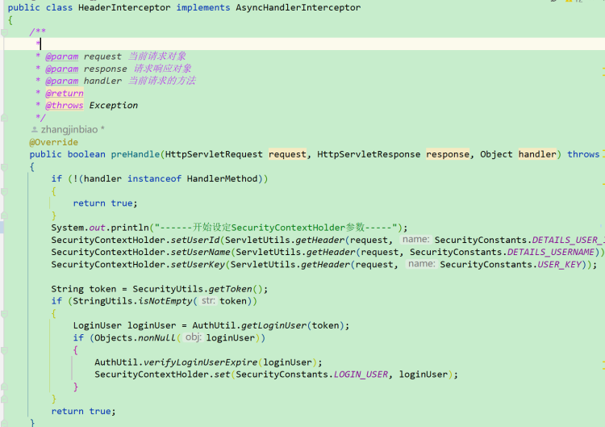



​	而当我们需要进行权限校验时，按照如下方式即可：



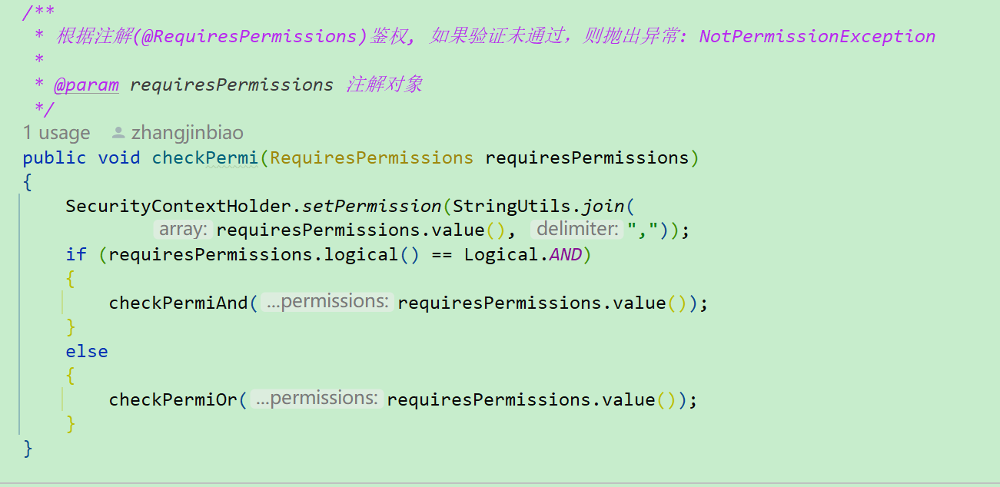



​	使用时，直接在某个控制类上面加上注解即可



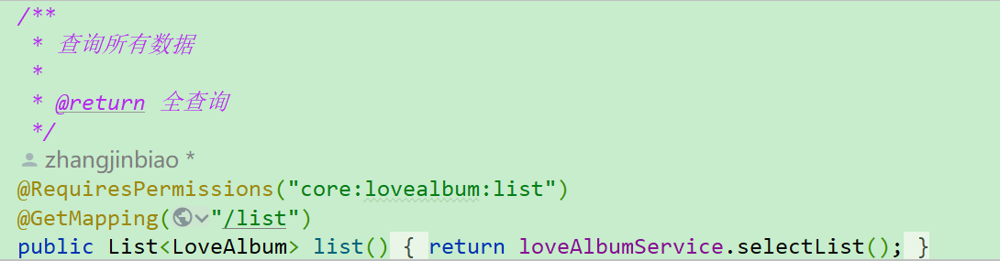

## Auth授权登录模块 

​	当前模块用于完成用户之后所有操作的授权，该模块提供用户登录，注册，刷新token有效期，退出等功能。

​	该模块保证了用户接下来的各种操作能顺利进行。

​	当用户登录成功后，将会根据当前用户的信息，返回一个token给前端，token解析后可以获取当前用户的userid，username，userkey等信息，而这些信息为接下来的所有操作提供了便利。

​	同时为了减少系统间的耦合，当前模块使用Feign进行远程调用，调用系统用户模块提供的接口来进行用户信息的获取以及注册等功能。

​	上面我们的网关的请求就是发送到Auth模块来判断用户是否登录成功的，也就是最终的token返回依赖于auth模块。



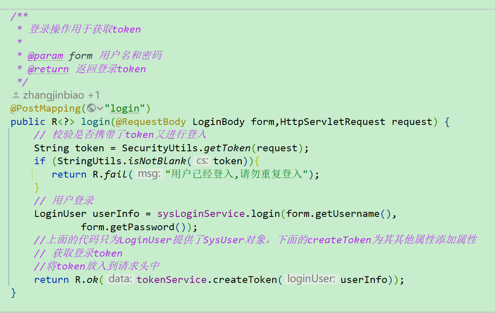

## 请求处理流程 

​	**项目请求流程：**

​	**前端代码-->Nginx-->Gateway-->Auth模块(远程调用)-->System模块-->Auth模块(登录成功,获得请求头信息)-->访问其他模块-->对应模块通过请求头信息进行处理-->访问成功/失败**

**	由于项目使用了SpringSecurity，并且我们对项目的过滤器链进行了封装。**

**	所以项目的请求流程处理大概如下：**

​	**Gateway-SentinelFallbackHandler（熔断限流处理）---》Gateway-CacheBodyGlobalFilter---》Gateway-AuthFilterGlobal（网关鉴权）---》IPAndCodeCheckGlobalFilter---》Security-HeaderInterceptor（SecurityContext数据填充）**

​	现在单独介绍上面每一个模块的功能：

​	1：CacheBodyGlobalFilter是为了解决ServerHttpRequest中body的数据为NULL的情况

​	2：AuthGlobalFilter作用是用于判断当前请求是否需要token，如果当前请求需要，则获取token数据并且保存到请求头中，保存到请求头中的信息包括，userId，username，userKey，而这里的token来自于Auth这个模块在用户登录之后进行返回。

​	这个过滤器同时也会记录用户短时间内的请求次数，如果超过一定限制，将会被加入黑名单，需要我们管理员手动解除限制。



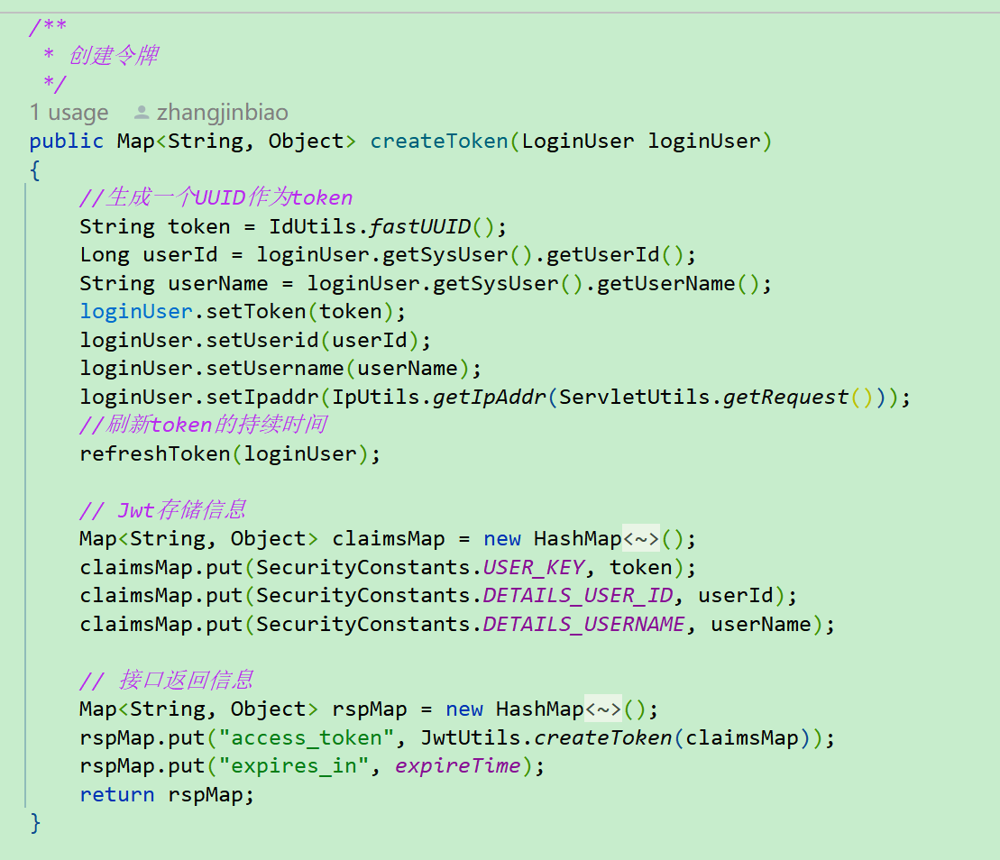



​	3：IPAndCodeCheckGlobalFilter这个过滤器用于过滤黑名单IP以及用于检查用户登录时输入的验证码是否正确。

​	4：HeaderInterceptor自定义请求头拦截器，将Header数据封装到线程变量中方便获取。

​	注意：此拦截器会同时验证当前用户有效期自动刷新有效期。



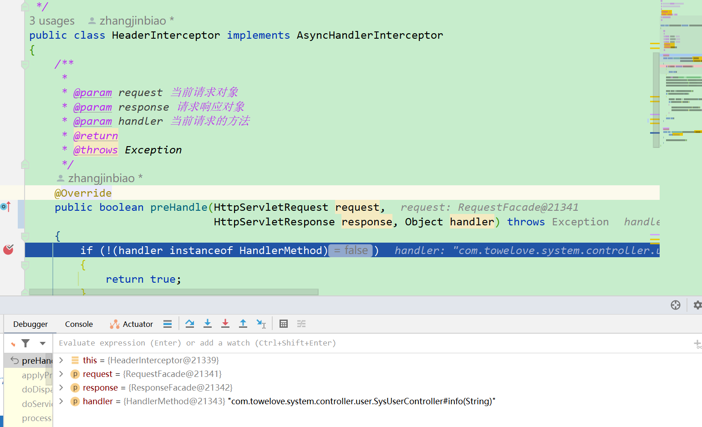



​	根据上面的基本介绍，我们可以知道我们项目的请求流程，当用户访问我们的网页的时候，TA可以随意的浏览我们的网页，当用户开始发送请求后。前端会将请求先发送到Nginx上进行请求重定向或者负载均衡，此时我们的请求会被发送到某一台网关服务器上，网关首先会进行限流熔断处理，之后网关服务器此时对请求进行过滤，如果当前请求需要携带token，但是请求头中没有，那么就报错返回，从而将带有敌意的请求，或者不合法请求直接过滤掉。如果当前请求合法，就执行接下来的逻辑，将请求头中的数据封装到SpringSecurity的SecurityContext中去，之后就开始请求的转发。将请求根据当前的注册中心的信息，分配到特定的后端服务器上进行处理。 

​	而一个用户想要正常的访问我们提供的功能，需要其进行注册登录。 我们会为登录的用户提供token信息，这个信息会被放在请求头中，之后用户的所有请求都会携带这个请求头，我们的网关将请求头中的信息解析完毕后，会对请求头中的信息进行保存，这样子之后如果需要用户信息，我们只需要从保存的地方取出即可。 同时，上面我们提到了我们将注册信息以及获取用户信息设定为了通过远程调用的方式，之所以只需要这两个接口来提供远程调用是因为：

​	首先用户的注册模块，这是毋庸置疑需要使用远程调用的。

​	主要介绍的是为什么只需要将用户信息获取的接口提供出来，就不再需要提供用户登录的接口了。

因为我们的登录接口其实就是校验用户的信息是否合法以及是否存在于数据库中，那么我们只需要获取到用户的信息，就可以对用户的这一次登录请求直接进行处理了，因此不再需要额外提供一个登录接口。而我们也会对使用了远程调用的请求进行处理，我们的远程调用处理类实现了RequestInterceptor接口，在项目发送远程请求的时候，也会再次检查请求头中是否封装了合理的用户信息，如果没有依旧是报错返回。

那么用户在注册登录完毕之后，就可以正常的使用我们的项目了，以上就是大致的请求处理流程。

## 系统模块（System） 

当前系统只有两个身份：管理员，用户。

这两个模块中的所有功能大概如下，并没有完全全部实现，后续会慢慢的完善所有功能。

### 管理员模块 

这个模块对应的是SysUserController。

1：管理员登录退出，管理员登录后，会在请求头里面设定一个参数叫做from-source，有了这个之后允许管理员访问内部权限方法。（完成）

2：管理用户，增删改查用户。（完成）

3：点击用户后查询到用户对应的消息设定，根据当前用户id查询当前用户设定的所有消息。

4：用户对应的消息操作，管理员可以删除用户定义的不合理的消息。

5：发布公告消息，项目拥有公告栏，管理员可以发布公告信息。

6：管理员对用户的任何操作，用户都必须知道，也就是需要给用户设定一个邮箱来接受管理员或者系统的消息。例如用户名称，用户的短信信息被变更后，需要向当前用户发送短信提醒。

### 用户模块 

1：用户注册。（完成）

2：用户登入，登出。（完成，二维码登入，微信接口对接，未完成）

3：修改用户名，密码，修改密码的时候需要用到验证码，头像上传，修改用户信息。（完成）

4：绑定情侣，情侣关系签到（附带奖励机制），需要编写一张情侣表。参数为绑定情侣的两个人的userid即可

5：定时消息设置，可以附带接收方当地天气，温度等等信息，使用特殊字体，能发照片和附件（照片和附件的发送还未完成）。

6：记录自己的日常博客，日志相册功能。（完成）

7：用户发送1短信可以选择电子邮件也可以选择使用短信，短信需要收费，电子邮件则每个用户只能有五条的短信上限。

8：上架商城，纪念日礼物，周年庆礼物等等，单独的模块。

9：允许用户上传照片，要么使用OSS服务，要么就是自己使用Minio，需要对照片的格式和大小作限定。（完成）





### 用户消息模块 

​	如果我们想使用Java程序来发送电子邮件，我们需要发送者的邮箱，邮箱的smtp编码，邮箱发件人，邮箱端口等信息。因此我创建了一个类来保存这些信息。



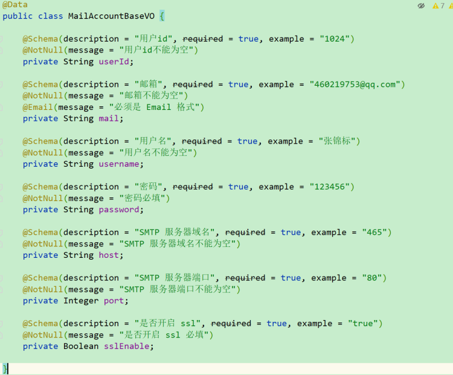



1：当前模块要求为用户提供增删改查邮箱账户信息的功能。（完成）

2：管理员需要能够得到所有的邮箱账户信息并且进行管理。

系统同时还设定了电子邮件的日志信息，电子邮件的模板信息，这两个功能并没正式开始使用，只是简单的编写了代码，因为暂时不是完成MVP最小可用产品(minimum viable product)所必须的功能，所以这些功能后期有可能会实现。

## 系统任务模块（Msg-Task） 

模块设计思路

这个模块的作用就是提供用户自定义自己要发送的短信的信息了。类信息定义如下。



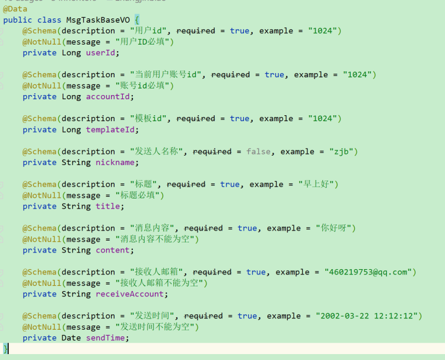



在这个模块，用户需要设定邮件标题，邮件内容，接收邮件人的邮箱，定时发送邮件的时间。

注意点：

这里还需要注意一个点，就是，我们知道任务是允许定时发送的，那么在即将发送的时候，如果发生了消息内容的更新怎么办？这就是我当初经常干的事情，但是我那个项目是只给自己用的，因此完全不需要担心修改了发不出去，因为只要是在投递之前修改的内容，他最后都会重新读取一次Nacos上面的短信信息，但是这种给了所有人使用的时候，就不可能使用Nacos了，必须考虑一个法子，在消息被更新之后，如果这个消息还不需要被发送，但是即将被发送，那么就需要更新这个消息的内容。

完整的说，比如我们新建一个消息，修改一个消息，删除一个消息，如果这个消息是下一个时间段需要发送的消息（比如一个时间段是10分钟），那么如果这个消息我们已经放入到了一个用于发送消息的队列中，那么我们就需要从这个队列中取出这个消息，并且进行更新。比如从队列中增删改这个消息信息。



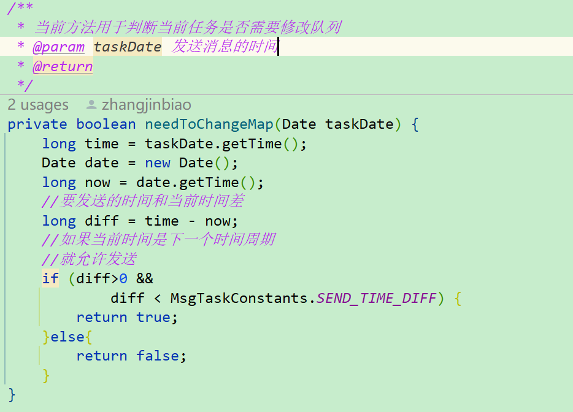



下面就是我向RocketMQ去发送这个消息，然后让监听器去监听消息并且进行修改消息队列中的消息信息。当然，这里其实也可以使用异步任务的方式来完成。



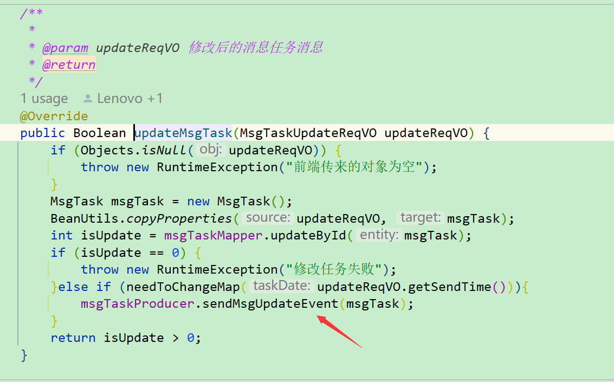





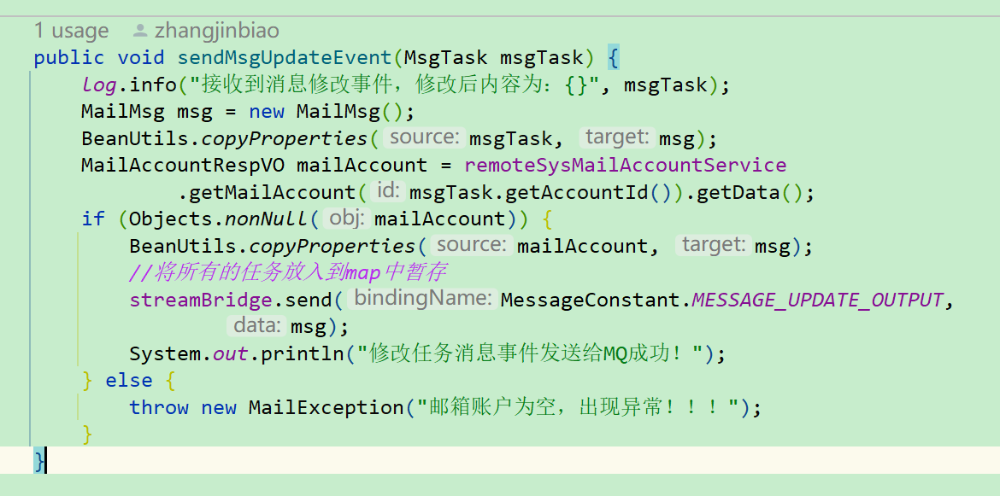



上面的图片中，就已经完成了向RocketMQ中发送一条消息了，之后，我们只需要配置一个监听器来监听这个消息即可。代码如下：



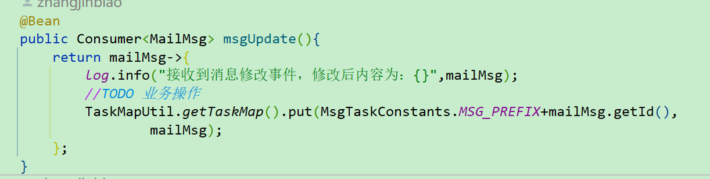




既然是要做到消息的定时发送，并且这是一个分布式项目，那么我们就需要确保，发送消息的时间，不会由于项目的奔溃，就导致设定的时间全部乱套消失，因此关于消息的定时管理，我使用的是xxl-job。

该模块最重要的就是了解xxl-job，这个模块决定了我们项目的核心主题---定时任务的发送。

该模块同时需要配合的就是我们的邮件发送模块。

任务最基本的就是进行CRUD，也就是允许用户增删改查。

之后，我们需要考虑的就是，什么时候要去加载任务。

所以，需要考虑到给任务的发送时间，添加一个索引，并且这个发送时间可以不适用datetime，直接使用varchar来存储，然后读取之后，写一个函数去转成对应的时间，然后就可以按照任务的时间进行排序，然后延迟发送。

当前模块提供页面给用户进行短信邮件的添加，允许用户设定邮件的发送时间，邮件的接收人，邮件的内容，主题。

邮件早期的内容可以只是自定义的内容，之后等我们了解了spring-boot-mail之后，我们可以再添加一些额外的功能，比如添加彩色字体，添加天气。

这个模块需要做到的就是，如果用户添加了短信，我们需要知道什么时候去把这个任务去加载到项目中然后准备去发送。

这个项目是允许用户不断的去更新，添加，删除，查看他所编辑的邮件的。

### 定时任务的设定 

上面已经说过了，任务的定时发送我们使用的是xxl-job。

我的思路是，首先取出下一时段需要发送的消息，并且保存到ConcurrentHashMap中去。

当我们取出所有消息并且将这些消息放入到RocketMQ之后，我们就会清空Map集合。

大致配置方式如下：

当我执行XXL-JOB上面的定时任务之后，这些任务将会调用对应的方法，把我的消息放入到map集合中。

然后会调用RocketMQ的监听器方法，监听器监听到对应时间之后来完成邮件的发送。



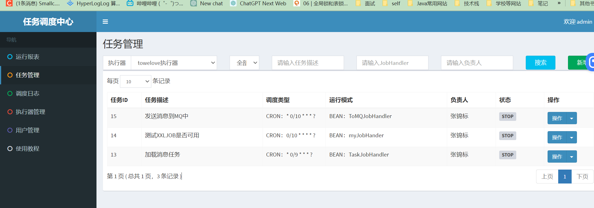





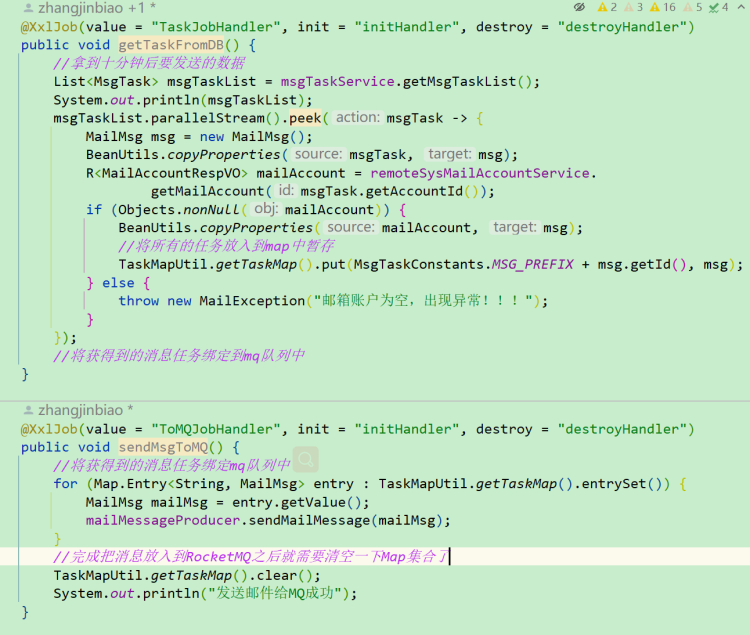





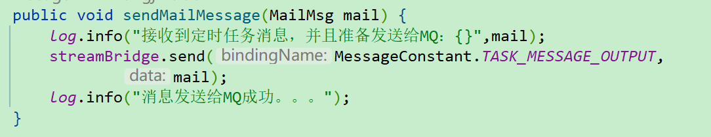



下面这个就是消息真正的发送逻辑。当我在XXL发送任务的时候，就会将这些封装好的完整的任务发送到RocketMQ中然后进行保存准备发送。

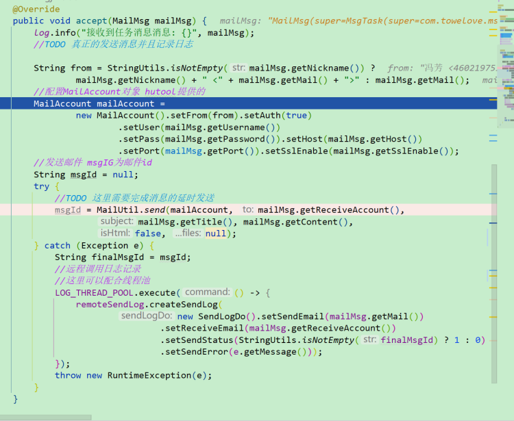



### 电子邮件发送模块 

这个模块可以使用hutool提供的send的方法，只需要为参数提供邮件的信息即可。

TODO：这个模块后期需要允许添加附件功能，并且需要了解如何发送html格式的邮件。

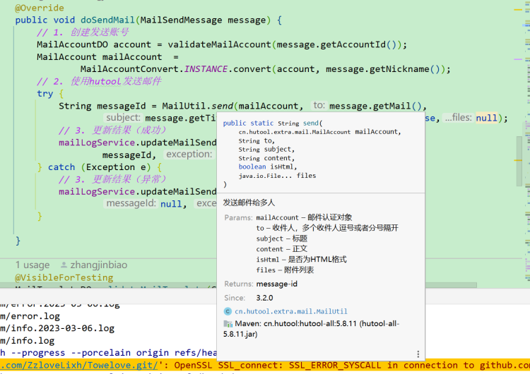



这里需要用到很多的信息，包括发件人信息，收件人信息，主题，消息内容，等等。

消息发送成功后如下：











#### 用户注册后发送邮件给用户 

这里可以编写一个操作，就是在用户注册之后，发送邮件给用户。

可以使用事件监听机制和发布机制来完成这个操作。



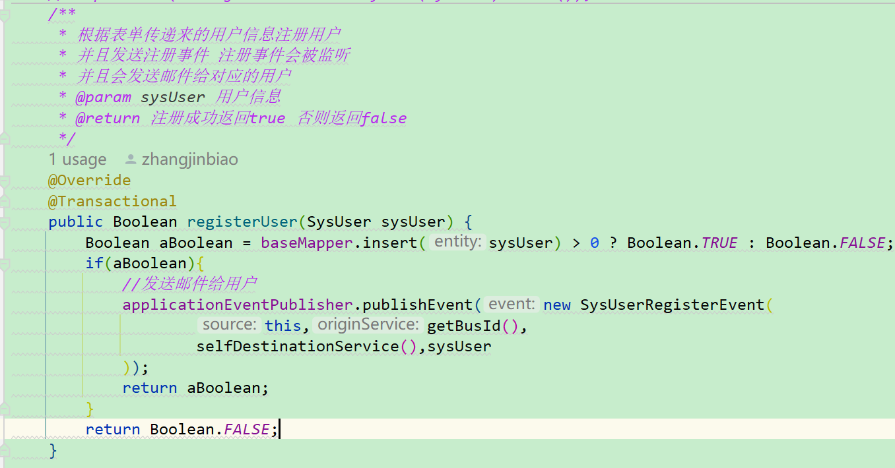





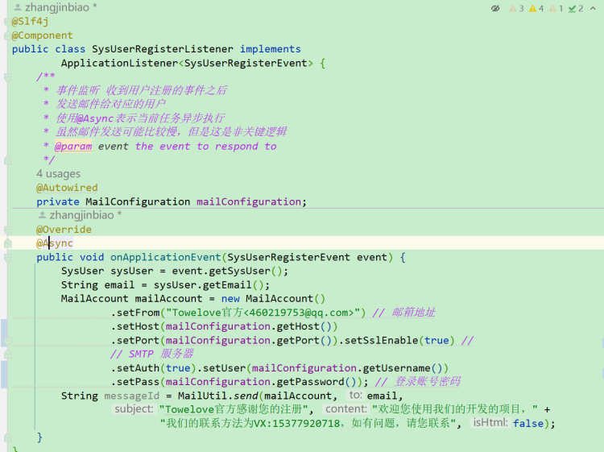


## 系统核心模块（Core）

这一个模块是这个项目中最重要的一个模块，它提供了相册记录功能，以及项目内查看邮件的功能。
<a name="tsA9u"></a>

### 恋爱相册（LoveAlbum）

恋爱相册需要绑定情侣关系的两人才能开启，当当前用户并没有绑定情侣关系的时候，只能查看到我们设定的预览的功能，而不能真的去使用这个功能。只有当前用户邀请或者绑定了另一半之后，才能真的开启恋爱相册这个功能。<br />
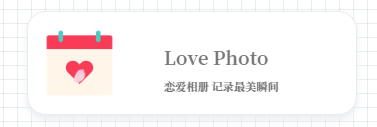
同时恋爱相册由于设计的时候绑定了两个人的信息，所以，我们后面的很多业务逻辑都依赖于恋爱相册这个表。<br />比如，当我们的用户登录之后，我们会从数据库中查询出来其在恋爱相册中对应的伴侣的userId，然后根据这个userId我们会查询出来当前用户对应的伴侣的信息，那么此时就可以完成两个伴侣的头像和数据的展示了。
<a name="yGAjC"></a>

### 恋爱日志（LoveLogs）

当当前用户成功的开通恋爱日志之后，就可以在恋爱日志里面放上内容了。<br />大概情况如下<br />
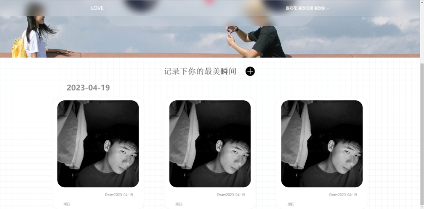
<a name="mNiZI"></a>

### 爱情邮局（LovePostOffice）

上文讲过，要开通恋爱相册需要绑定另一半，那么此时就需要一个功能来邀请另一半。<br />我们分为了如下两种情况：<br />第一种情况：<br />如果当前用户还没有注册，那么我们要求当前已经注册的用户填写被邀请用户的电子邮箱，我们将会发送一个官方邮件给这位用户来邀请TA注册项目，并且此时TA可以填写邮件中的邀请码来直接在完成注册功能后直接绑定TA的伴侣。<br />第二种情况：<br />当前被邀请的用户已经注册了，那么此时我们就需要要求发送邀请的用户发送一个项目内的邮件到另一半的邮箱里，然后只需要被邀请的另一半同意这个请求即可。<br />此时我们提供了二选一的方案，如果知道被邀请用户的邮箱，那么输入邮箱后我们会发送电子邮件给受邀用户，而如果输入的是用户的用户名，那么我们会根据用户名来找到指定用户并且进行发送。<br />这里如果使用的是用户名查询，那么我们会在用户输入完毕用户名之后，然后在输入框下面展示用户头像，来确保你没有邀请错误人。<br />为了确保不出现不良情况，我们确保了只要这一次的邀请没有被同意或者拒绝，这名用户都不能再一次的邀请另一名情侣（多渣呀）。<br />同时当另一半解除关系时，我们也会通过这个邮局来发送消息。<br />系统的各种消息都会发送到这个邮局里，请注意查收哦。
<a name="PcLiq"></a>

### 时间线（TimeLine）

这个功能记录的是两个人在恋爱过程中发生的比较重大的时间，大概样式如下，用于记录某一天发生了什么事情。<br />
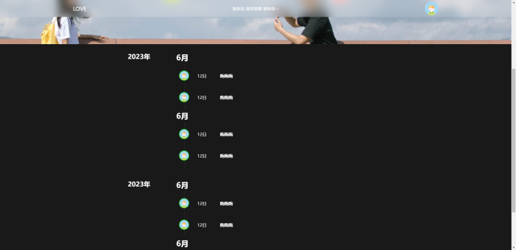


<a name="RUXA5"></a>

### 待办列表（LoveList）

待办列表就是用于记录两个人在一起希望能一起做的事情。<br />当完成了待办列表的时候，就可以上传图片了。<br />
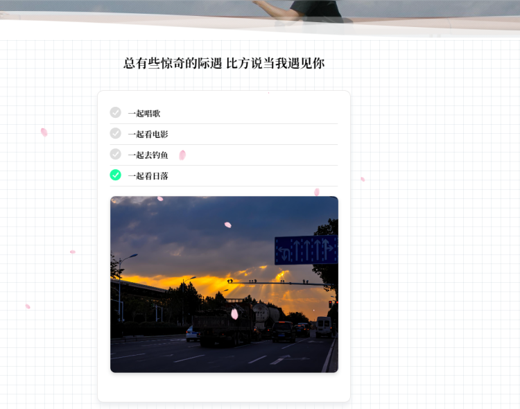
